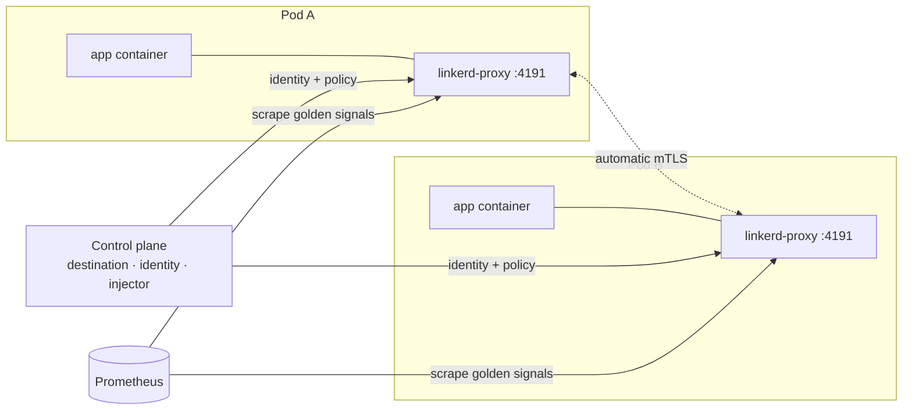

# Linkerd — Architecture

> Ultralight service mesh for the Kubernetes platform: per-pod mTLS identity, declarative retries/timeouts and golden-signal network telemetry — no application changes. East-west only; the edge is Kong.

## Overview

Linkerd installs a control plane into the `linkerd` namespace
(`values/linkerd-values.yaml`, dev profile). Workloads opt in per chart via
the `linkerd.io/inject: enabled` annotation declared in
[infra-kubernetes](https://github.com/sca-templates/infra-kubernetes); the
proxy-injector webhook then adds an ultralight sidecar (`linkerd-proxy`) to
every matching pod. Inside the cluster, Kubernetes DNS plus the mesh replace
Consul discovery and TCP health checks entirely.

## Components

| Component | Runs as | Purpose |
| --- | --- | --- |
| destination | control-plane deployment | Resolves service identities and policy for each destination |
| identity | control-plane deployment | Issues and rotates workload certificates (24h) |
| proxy-injector | control-plane deployment (webhook) | Injects sidecars + identity slots into annotated pods |
| linkerd-proxy | sidecar container | mTLS, retries/timeouts, telemetry on `:4191` |

Dev profile runs one replica of each; production overrides (HA, 3 replicas)
live in `infra-kubernetes/envs/<env>`.

## Data flow

Every request between meshed pods is mutually authenticated: both proxies
verify SPIFFE workload identities (`trustdomain.namespace.serviceaccount`)
issued by Linkerd identity before any payload moves. Retries and timeouts are
declared per route in service charts — never in application code.

## Telemetry

Each sidecar exposes latency, throughput and error rate per remote pair at
`:4191/metrics`. The platform Prometheus scrapes these endpoints in-cluster,
so Grafana gets mesh-wide golden signals next to infrastructure metrics.
Dashboards live in [infra-grafana](https://github.com/sca-templates/infra-grafana).

## Configuration and secrets

- `values/linkerd-values.yaml` is the dev single source of truth: HA off,
  heartbeat disabled, modest proxy resources, self-signed issuer rotated
  every 24 hours.
- No Vault AppRole is wired here — Linkerd identity issues its own
  certificates in-cluster. If issuer trust moves to Vault/cert-manager, the
  integration is declared in `infra-kubernetes` and linked from this note;
  the local values stay unchanged.
- `.env` (optional, gitignored) only pins `LINKERD_VERSION`,
  `LINKERD_NAMESPACE` and `KUBECONFIG`.

## Production reference

Production runs the same install shape with HA values from
`infra-kubernetes/envs/<env>`, applied by ArgoCD
([infra-argocd](https://github.com/sca-templates/infra-argocd)). Upgrades are
a version bump riding the platform release train — never a manual `make
install` against prod.

## Related

- [README.md](../README.md) — commands, lifecycle and troubleshooting.
- Vault note: [04-infrastructure/linkerd.md (sca-docs)](https://github.com/sca-templates/sca-docs/blob/main/04-infrastructure/linkerd.md).
